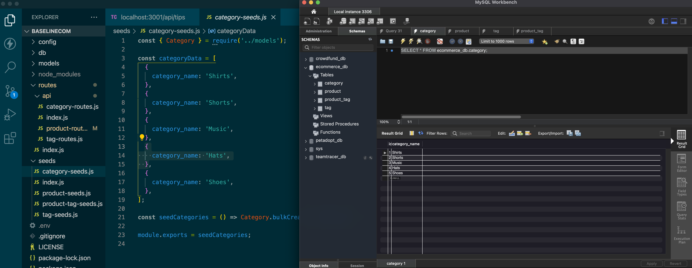
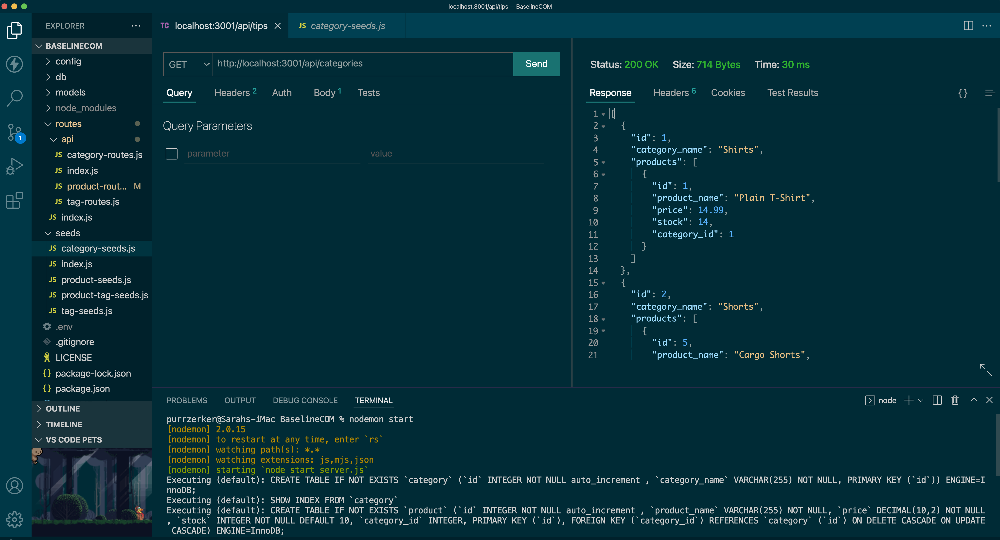

# 13: "BaselineCOM" E-Commerce Back-End

#### Licensed under [MIT](LICENSE)

## Table of Contents

- [Project Description](#project-description)
- [Usage](#usage-instructions)
- [Links](#links)

## Project Description

This node.js program uses the NPM packages dotENV, Express, and MySQL2 to connect VSCode to the MySQLWorkbench in order to run a basic e-commerce back-end.

Uses 'Thunder Client' to test API GET, POST, PUT, DELETE routes to ecommerce database

## Usage Instructions

- To begin, create your database by opening the schema folder. Copy/paste the schema contents into the MySQLWorkbench Query and click the 'lightening bolt' symbol. Refresh the schemas.
- To seed data into the ecommerce database, open the terminal and enter <code>npm run seed</code>
- Install and open 'Thunder Client' API extension to test API routes and database contents
  

## Links

- Repository: https://github.com/Sarahlophus/BaselineCOM
- Walkthrough video: https://drive.google.com/file/d/19xQDa9n2Bg8JY3JKiwCypUwQ_5fue9bF/view?usp=sharing
